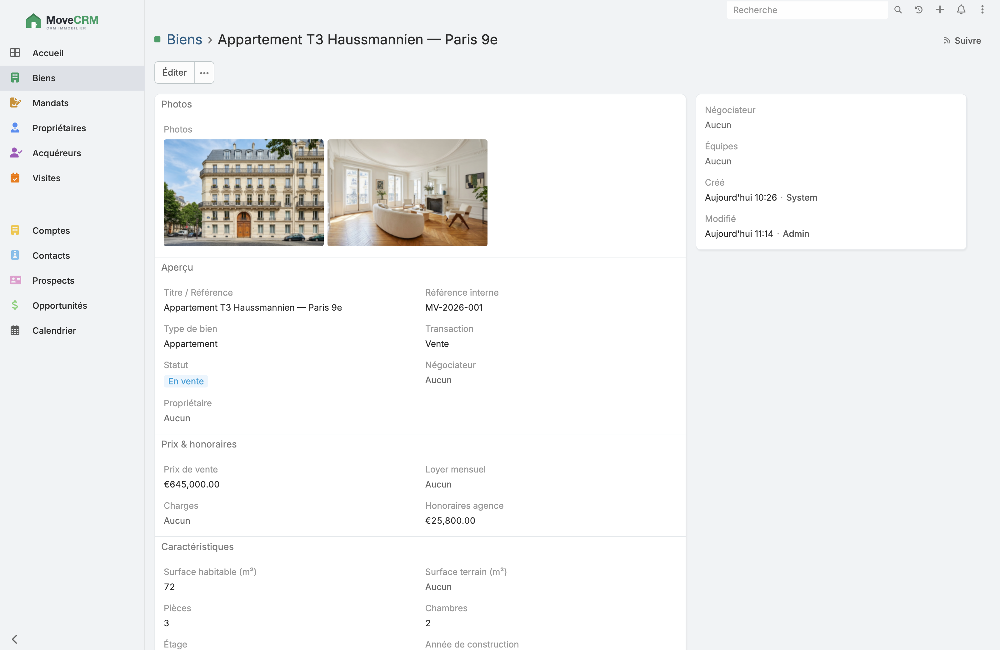

  

<h1 align="center">MoveCRM</h1>

<strong>Un CRM open-source gratuit pour les agences immobilières françaises.</strong>

MoveCRM équipe les agences immobilières d'un CRM puissant, gratuit et auto-hébergeable :
gestion des biens (mandats vente/location), propriétaires, acquéreurs et locataires,
visites, et suivi du pipeline commercial de la prospection jusqu'à l'acte.

  
   
  <em>Fiche bien : photos, caractéristiques, prix & honoraires, statut du mandat.</em>

> ⚖️ **MoveCRM est un dérivé d'[EspoCRM](https://www.espocrm.com)** (AGPL-3.0), adapté au
> métier de l'immobilier en France. Voir [`NOTICE.md`](NOTICE.md) pour l'attribution
> complète. Ce projet n'est pas affilié à EspoCRM.

## Pourquoi MoveCRM

Les agences immobilières paient cher des CRM SaaS propriétaires. MoveCRM propose une
alternative **libre et gratuite**, pensée pour leur métier :

- **Biens** — mandats de vente et de location, caractéristiques, statut, médias
- **Propriétaires & mandants** — suivi des mandats et des biens rattachés
- **Acquéreurs & locataires** — critères de recherche, budget
- **Visites** — planification, comptes rendus
- **Pipeline** — prospection → mandat → visite → offre → compromis → acte
- **Matching** — rapprochement automatique acquéreur ↔ bien

## Statut

🚧 En développement. La base CRM (entités, vues, droits, API REST) provient d'EspoCRM ;
la couche métier immobilière est en cours de construction.

## Stack

- Backend : PHP (API REST)
- Frontend : single-page application
- Base de données : MySQL / MariaDB
- Personnalisation des entités métier via l'Entity Manager d'EspoCRM

## Installation

Voir la documentation d'installation d'EspoCRM (identique pour la base technique) :
https://docs.espocrm.com/administration/installation/

Le détail spécifique à MoveCRM (entités immobilières, déploiement) sera documenté ici.

## Licence

MoveCRM est distribué sous **GNU AGPL-3.0**, identique à EspoCRM dont il dérive.
Voir [`LICENSE.txt`](LICENSE.txt). Conformément à l'AGPL, toute instance hébergée
en SaaS doit donner accès au code source à ses utilisateurs.

## Crédits

Construit sur le travail du projet **[EspoCRM](https://github.com/espocrm/espocrm)**
et de sa communauté. Merci à eux.
